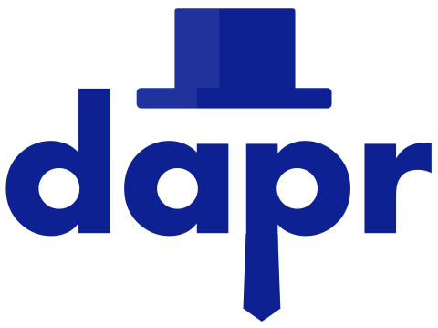

# dapr 🎩 Starting Point

This page contains a set of resources to start working with **dapr**.

## What is **dapr**?

 **d**istributed **ap**plication **r**untime

> *dapr is a portable, event-driven runtime that makes it easy for any developer to build resilient, stateless and stateful applications that run on the cloud and edge and embraces the diversity of languages and developer frameworks. Leveraging the benefits of a sidecar architecture, Dapr helps you tackle the challenges that come with building microservices and keeps your code platform agnostic.*

## Learn dapr 🧑‍🎓

Docs to learn Dapr:

- ✔️ [Dapr docs](https://docs.dapr.io/)
- 🏎️ [Dapr quickstarts](https://docs.dapr.io/getting-started/quickstarts/)
- 🧑‍💻 [Dapr on GitHub](https://github.com/dapr)
- 👑 [Dapr for .NET](https://learn.microsoft.com/en-us/dotnet/architecture/dapr-for-net-developers/getting-started)

Videos about Dapr:

- ➽ [Dapr YouTube channel](https://www.youtube.com/channel/UCtpSQ9BLB_3EXdWAUQYwnRA)
- ☯ [Actors on Kubernetes with Dapr & Azure Cosmos DB](https://www.youtube.com/watch?v=73DUN5PhuZQ)
- ▶ [Actor Model Explained](https://www.youtube.com/watch?v=ELwEdb_pD0k)
- ✚ [Introduction to Dapr](https://www.youtube.com/watch?v=nK8Ss2UMAxc&t=20s)

## Community 🤗

- 💬 [Dapr Discord](http://bit.ly/dapr-discord)
- ⤬  [Dapr Twitter](https://twitter.com/daprdev)
- 🎧 [Bi-weekly Dapr OSS Community Calls](https://github.com/dapr/community#community-meetings)

## Present dapr 🧑‍🏫

Resources to make presentations about Dapr:

- 📢 [Dapr presentation deck](https://docs.dapr.io/contributing/presentations/)
- 🖼️ [Dapr logos @ CNCF](https://github.com/cncf/artwork/blob/master/examples/incubating.md#dapr-logos)
- 🚦  [Dapr workshop by @EdwinVW](https://github.com/EdwinVW/dapr-workshop)
